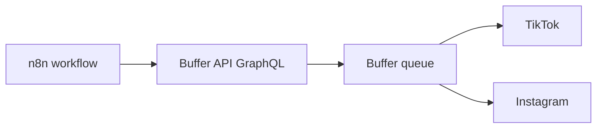

# Buffer + n8n — Automated posting (API → queue → TikTok / Instagram)

**Goal:** Your workflow (e.g. n8n) sends **caption + optional image URL** to **Buffer’s API**; Buffer **queues or publishes** to the **channels you already connected** (TikTok, Instagram, etc.).

**Official docs:** [Buffer GraphQL API](https://developers.buffer.com/reference.html) · [Getting started](https://developers.buffer.com/guides/getting-started.html) · API key: **[publish.buffer.com/settings/api](https://publish.buffer.com/settings/api)**

**Compliance:** You are still responsible for claims and rights on anything posted. See `docs/COMPLIANCE.md` and `docs/GAMETIME.md`.

---

## What you need first

| Requirement | Why |
|-------------|-----|
| **Buffer account** | Hosts the queue and connections. |
| **TikTok + Instagram connected in Buffer** | Same as `docs/BUFFER_WORKFLOW.md`—Business accounts, permissions, etc. |
| **Buffer API key** | `Authorization: Bearer …` on every request. Create at **[API settings](https://publish.buffer.com/settings/api)**. |
| **Channel ID(s)** | Each connected profile (e.g. TikTok, IG) has an **id** you pass into `createPost`. |
| **Public HTTPS URL for images** (if posting images) | Buffer pulls **`assets.images[].url`** from the open web—**not** a file path on your Mac. Use GitHub raw, S3, CDN, etc. (`docs/N8N_SETUP.md` **Images** section). |

Confirm on Buffer’s site whether your **plan** includes API access; if anything fails, check their current pricing/help.

---

## Architecture



Optional upstream: **OpenAI** node generates caption → **HTTP Request** sends to Buffer.

---

## Preset background images (repo + n8n)

**Where to put the files (masters)**

| Location | Use |
|----------|-----|
| **`content/media/presets/`** in this repo | Your PNG/JPG/WebP backgrounds (brand-safe, licensed, or original). Commit like any asset. Optional subfolders: `content/media/presets/dark/`, `light/`, etc. |

**What n8n does *not* do:** There is no special “image library” inside n8n. You **don’t upload presets into n8n** for Buffer to fetch. You give Buffer a **URL string** per post.

**How to get a URL Buffer can use**

1. **GitHub (simple):** Push `content/media/presets/` to a **public** repo → each file has a **raw** URL:  
   `https://raw.githubusercontent.com/OWNER/REPO/BRANCH/content/media/presets/your-bg.png`  
   Private repo raw URLs need auth—Buffer can’t use those—so use **public** assets or another host (**S3**, **Cloudinary**, **Cloudflare R2**, etc.) with a stable public link.

2. **n8n workflow:** Add a **Set** node (or **Code**) that defines an array of preset URLs and picks one:
   - **Rotate:** use workflow execution index or a counter.
   - **Random:** `Math.floor(Math.random() * urls.length)` in a **Code** node.
   - **Match theme:** map `theme` from an earlier node → one URL per theme.

3. **Merge before Buffer:** Pass the chosen string into **`createPost`** as `assets.images[0].url` (with your caption in `text`). See **Step B** below.

**Rights:** Only use backgrounds you own or have a license for; see `docs/COMPLIANCE.md`.

---

## Step A — Get `organizationId` and `channelId`

All requests:

- **URL:** `POST` **`https://api.buffer.com`**
- **Headers:** `Content-Type: application/json` · `Authorization: Bearer YOUR_API_KEY`
- **Body:** JSON `{ "query": "…one GraphQL string…" }`

### A1) Organizations

```graphql
query GetOrganizations {
  account {
    organizations {
      id
    }
  }
}
```

Copy one **`organizations[].id`** → use as `organizationId` below.

### A2) Channels (pick TikTok vs Instagram)

```graphql
query GetChannels {
  channels(input: {
    organizationId: "YOUR_ORGANIZATION_ID"
  }) {
    id
    name
    displayName
    service
  }
}
```

Note each **`id`** and **`service`** (or `displayName`) so you know which ID is TikTok vs Instagram. You’ll run **`createPost` once per channel** if you want the same post on both—or separate workflows.

**Tip:** Run these queries once in **curl**, **Postman**, or a temporary **n8n HTTP Request** node; store IDs in n8n **Variables** or a **Set** node.

---

## Step B — Create a post (Buffer queues or publishes it)

Use the **`createPost`** mutation. Modes include **`addToQueue`**, **`shareNow`**, **`shareNext`**, **`customScheduled`** (see Buffer’s **Create Scheduled Post** example for `dueAt`).

### Text-only post (example)

```graphql
mutation CreatePost {
  createPost(input: {
    text: "Your caption here #GameTime"
    channelId: "YOUR_CHANNEL_ID"
    schedulingType: automatic
    mode: addToQueue
  }) {
    ... on PostActionSuccess {
      post { id text }
    }
    ... on MutationError {
      message
    }
  }
}
```

### Image + caption (your case: images)

Add **`assets.images`** with a **public `url`** (HTTPS):

```graphql
mutation CreatePost {
  createPost(input: {
    text: "Caption + hashtags"
    channelId: "YOUR_CHANNEL_ID"
    schedulingType: automatic
    mode: addToQueue
    assets: {
      images: [{ url: "https://example.com/your-image.png" }]
    }
  }) {
    ... on PostActionSuccess {
      post { id text }
    }
    ... on MutationError {
      message
    }
  }
}
```

**Draft-only (you approve inside Buffer):** Buffer supports **`saveToDraft: true`** on `createPost`—see [Create Draft Post](https://developers.buffer.com/examples/create-draft-post.html).

---

## Step C — Wire this in n8n

1. **Credentials → Header Auth** (or generic **HTTP Header**):  
   - Name: `Authorization`  
   - Value: `Bearer YOUR_BUFFER_API_KEY`  
   Or put the raw key in a **HTTP Request** node header.

2. Add **HTTP Request** node:  
   - **Method:** POST  
   - **URL:** `https://api.buffer.com`  
   - **Body Content Type:** JSON  
   - **Body:** `{ "query": "<paste GraphQL as a single escaped string or use expression>" }`  
   - Easiest path: put the mutation in a **Code** node that returns `{ query: \`mutation ...\` }`, then pass to HTTP Request.

3. **Chain:**  
   - **Manual Trigger** (or Schedule) → **OpenAI** (optional caption) → **Set** (merge caption + image URL + `channelId`) → **HTTP Request** (Buffer).

4. **Dynamic caption:** Map OpenAI output into the `text` field inside the GraphQL string (escape quotes carefully) or use n8n’s GraphQL node if you prefer.

5. **Test:** Execute workflow → check Buffer’s **queue** in the web app → confirm it posts to TikTok/IG per your channel rules.

---

## Two channels (TikTok + Instagram) with one caption

- **Option 1:** Two **HTTP Request** nodes in parallel (same caption, different `channelId`).  
- **Option 2:** One node that runs twice via **Split** / **Loop** over channel IDs.

---

## Failure checklist

| Problem | Check |
|---------|--------|
| `401` / auth | `Authorization: Bearer` + valid key from Buffer API settings |
| `MutationError` | Channel ID wrong; channel disconnected in Buffer; post type not allowed for that network |
| Image not showing | URL not **public** HTTPS; hotlink blocked; dimensions/format rejected by platform |
| TikTok/IG rejects | Account type, Buffer’s current TikTok integration limits—see Buffer help |

---

## Related repo files

| File | Role |
|------|------|
| `docs/BUFFER_WORKFLOW.md` | Connecting TikTok/IG to Buffer (manual setup) |
| `docs/N8N_SETUP.md` | OpenAI + images URLs + Git drafts |
| `docs/COMPLIANCE.md` | Legal/safety |
