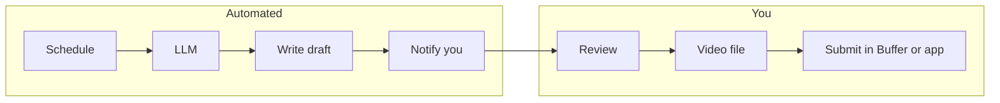

# n8n Vision — Auto Drafts → You Submit to Post

This doc turns **“hands-off marketing”** into something buildable: **automation generates and stores drafts**; **you** are the only finger on **Publish** (Buffer, TikTok app, or Meta)—unless you later add a separate, explicit approval workflow for API posting.

**Companion docs:** `docs/COMPLIANCE.md`, `docs/GAMETIME.md`, `prompts/CURSOR_MARKETING_AGENT.md`, `templates/TIKTOK_AD_SCRIPT.md`.

---

## What you’re building (one sentence)

**n8n runs on a schedule**, calls an LLM with your rules, **writes draft files** (and optionally notifies you); **you open the tool, review, attach video if needed, and hit submit/schedule.**

That is **not** unsupervised auto-posting—it is **supervised automation**: machines draft, humans publish.

---

## Step-by-step vision (the happy path)

### Phase 1 — “Submit to post” only (recommended first)

| Step | Who | What happens |
|------|-----|----------------|
| 1 | **n8n** | Cron fires (e.g. Mon/Wed/Fri 8:00). |
| 2 | **n8n** | Loads prompt context: static rules + optional theme from Sheet/Notion/calendar row. |
| 3 | **LLM** | Returns structured JSON or Markdown matching `templates/TIKTOK_AD_SCRIPT.md` sections (hook, demo beats, CTAs, 3 captions, optional hashtags ≤3). |
| 4 | **n8n** | Writes a file to your **draft sink** (see below) with a dated filename, e.g. `2026-04-15-gametime-draft-01.md`. |
| 5 | **n8n** | Sends you **Slack / email / Telegram**: “New draft ready — review before posting.” |
| 6 | **You** | Read draft; fix tone; confirm claims vs `docs/GAMETIME.md`; copy into Buffer’s composer **or** move file to `content/approved/` in this repo if you use Git. |
| 7 | **You** | Attach **video** (you or a tool produced earlier); **Schedule** or **Post** in Buffer/TikTok/IG. |

**Your “submit” is step 7**—automation never touches the publish button in Phase 1.

### Phase 2 — Same, but drafts land in this repo

| Change | Detail |
|--------|--------|
| **Draft sink** | GitHub/GitLab API: create or update file under `content/drafts/` in AutoMarketing. |
| **Benefit** | Single source of truth; Cursor can edit the same files. |
| **Cost** | PAT, branch strategy (e.g. `auto-drafts` → PR) if you want review before `main`. |

### Phase 3 — Optional: “draft + reminder” for video

| Step | What |
|------|------|
| After draft | n8n creates a **Calendar** event or **Notion task**: “Film or generate B-roll for draft X.” |
| You | Still upload the MP4 when posting—unless you add a **render** step (see Risks). |

---

## How auto–content generation fits (clear boundaries)

| Automated | Usually manual (for now) |
|-----------|---------------------------|
| Hook variants, script, captions, hashtags | Final legal judgment on claims |
| Filling the template structure | Filming or choosing AI video tool + export |
| Writing to draft storage | Clicking **Post** in Buffer / native app |
| Notifications | Attaching the right video file to the right draft |

**Video:** n8n can **trigger** a render service (Creatomate, Placid, FFmpeg on a VPS, etc.) in a later phase; that is a **separate** integration with cost and quality tradeoffs. Text-first automation is already valuable.

---

## Phased rollout (Tier A → C)

| Tier | Automation | Your role |
|------|--------------|-----------|
| **A** | Scheduled LLM → file/Notion + notification | Copy/paste into Buffer; submit |
| **A+** | Same + drafts committed to `content/drafts/` via Git API | Review in repo; submit |
| **B** | A+ + optional approval webhook (“Approve” in Slack runs sub-workflow that moves draft to `approved` path) | Submit only after approve |
| **C** | Buffer Publish API from n8n **after** explicit approval node | Rarely needed until volume hurts |

Stay on **A or A+** until drafts are consistently on-brand and compliant.

---

## Placeholder workflows (build these in n8n)

Name these clearly so you can find them later.

1. **`marketing-cron-draft-gametime`**  
   - Trigger: Schedule  
   - Nodes: Set variables (product=GameTime) → OpenAI/HTTP LLM → Code (format Markdown) → Write (Google Drive / Notion / GitHub) → Slack

2. **`marketing-manual-draft`**  
   - Trigger: Webhook or Manual  
   - Same LLM chain; use when you want an extra draft outside the schedule.

3. **`marketing-notify-only`** (optional)  
   - Reads “next theme” from Google Sheet row; passes to workflow 1 as input.

4. **`marketing-post-buffer-approved`** (Phase C only)  
   - Trigger: Only when you fire it or when row in “Approved” sheet is marked Ready  
   - HTTP Request → Buffer API (confirm your plan supports programmatic publishing)

Do **not** connect “cron → post to TikTok” without a human or explicit approval gate unless you accept brand and ToS risk.

---

## Draft sink options (pick one to start)

| Sink | Pros | Cons |
|------|------|------|
| **Google Doc / Drive file** | Fast to set up | Outside repo |
| **Notion page/database** | Nice UI, status column | Export for Git is extra |
| **GitHub `content/drafts/`** | Matches this repo | Needs PAT + rate limits |
| **Email to self** | Dead simple | Messy at scale |

**Recommendation:** Start with **Notion or Drive**; move to **Git API** when you want Cursor + n8n on the same files.

---

## Prompt packaging (what n8n should send the LLM)

Include in the system or user message (shorten as needed):

- **`docs/GAMETIME.md` is canonical** for GameTime features (personal game OS, IGDB, Now/Library/Discover/Stats, conditional claims).
- Excerpt or bullet list from **Allowed** + **Conditional** sections
- “Do not invent metrics; omit if unknown”
- Output must follow sections in `templates/TIKTOK_AD_SCRIPT.md`
- Require **3 hook variants + 1 safe/legal minimal variant**
- JSON or Markdown with fixed headings so the next node can parse or save as-is

You can store the full prompt in n8n’s **Set** node, or fetch from a **GitHub raw URL** to this repo’s `prompts/` file so one edit updates automation.

---

## Credentials checklist (fill as you go)

| Service | Purpose | Stored in n8n as |
|---------|---------|------------------|
| OpenAI (or other) API | LLM drafts | Credentials |
| Slack / Telegram / SMTP | Notifications | Credentials |
| Google OAuth | Drive/Sheets if used | OAuth2 |
| Notion | Pages/DB if used | Integration |
| GitHub/GitLab PAT | Write `content/drafts/` | Header or dedicated cred |
| Buffer | Phase C publish | API token (confirm scope) |
| TikTok Developer App | Direct post (advanced) | OAuth tokens + refresh |

**Security:** Use n8n **Credentials** vault; never hardcode tokens in workflow JSON you commit to a public repo.

---

## Alignment with repo rules

- **Drafts only:** Automation writes to **`content/drafts/`** (or external equivalent)—not `approved/` without your rule.
- **Submit:** You—or an explicit approval step—before anything hits Buffer or TikTok APIs.
- **Compliance:** LLM prompts must embed **allowed claims**; periodic human audit of outputs.

---

## Summary diagram

**Bottom line:** n8n makes **draft creation and notifications** automatic; **“hit submit to post”** stays your one-button control until you deliberately build and trust an API publish path with approvals.
